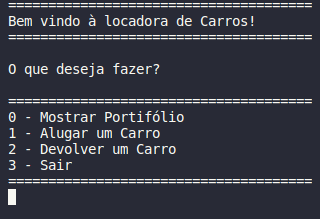

<h1 align="center"> Software de Gestão para Locadora de Carros </h1>

#Projeto desenvolvido no Módulo de Python Start da Trilha de Trading Quantitativo da Asimov Academy.  

  <a href="#-tecnologias">Tecnologias</a>&nbsp;&nbsp;&nbsp;

 

  

## 🚀 Tecnologias

Esse projeto foi desenvolvido com as seguintes tecnologias:

- Python
- Git e Github

